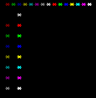
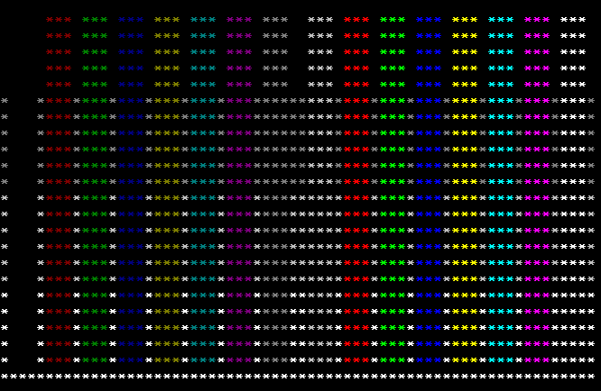
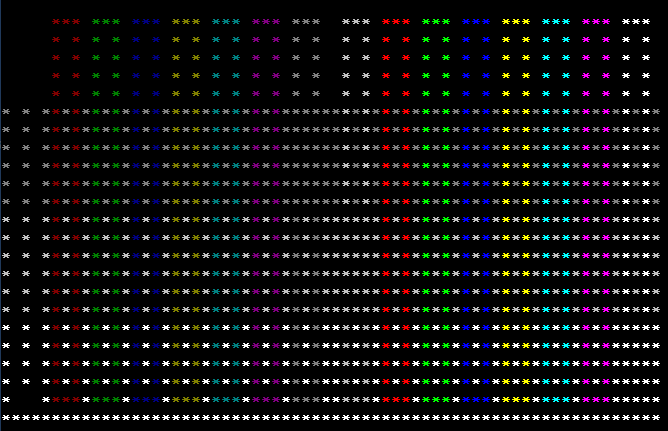
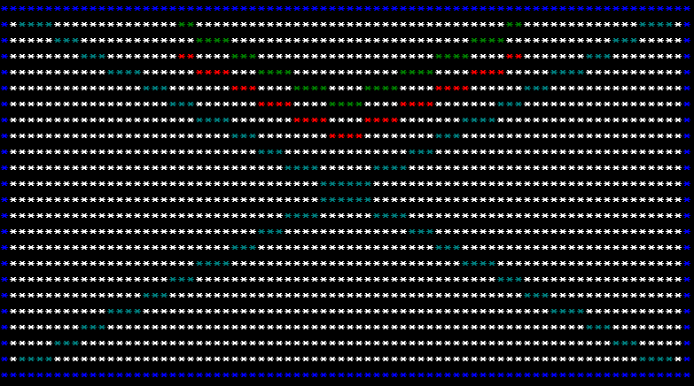

# tflex-test-task
Небольшая консольная программа, которая исполняет простенькие текстовые скрипты,
рисуя по ним картинки. Картинки потом можно вывести в цвете на консоль.

# Примеры выполнения:

### test_task < test_palette_pixels.txt

### test_task < test_palette_bars.txt 

### test_task < test_palette_boxes.txt

### test_task < test_lines.txt

